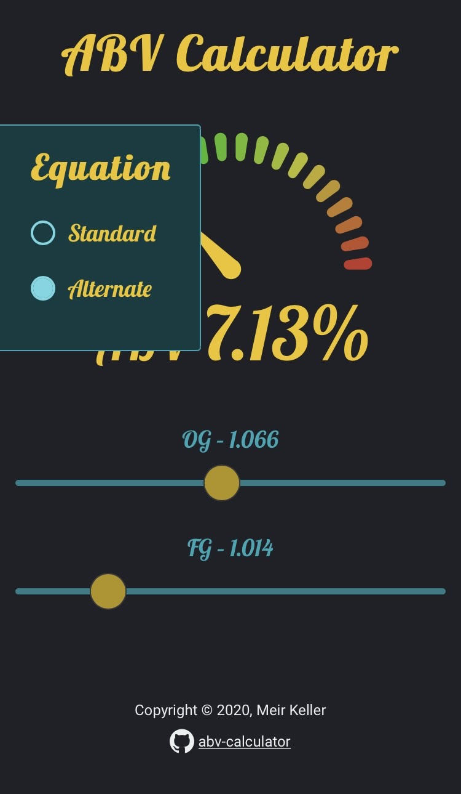

# ABV (Alcohol By Volume) Calculator

Finds ABV based on gravity change. If you took an original gravity reading (or had estimated OG), and also took a final gravity (FG) reading prior to adding priming sugar at bottling you can find out your batch's alcohol by volume ABV.

## Screenshots

   
   
   

### [Give it a try](http://meirkl.github.io/abv-calculator)
